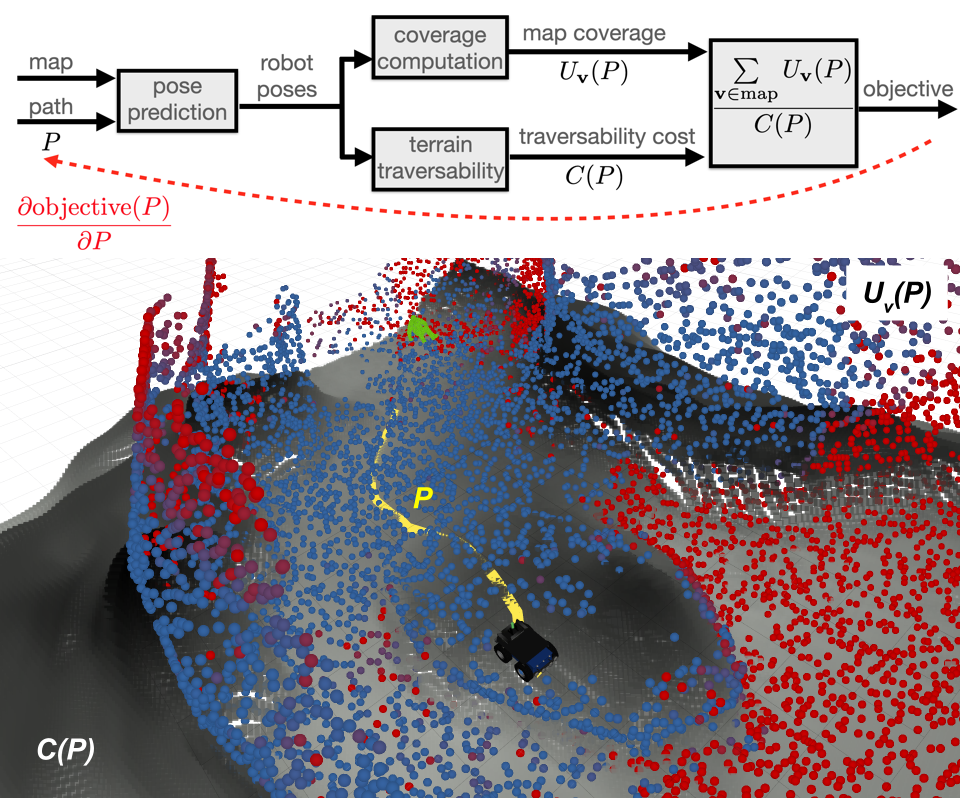

# RPZ Planning (RA-L 2022 with ICRA option)

[](https://ieeexplore.ieee.org/document/9699042)
[](https://docs.google.com/presentation/d/1WUqTYKdAe21JxEmdzwivXqo7qX3y2ghoJC7UWHFKY10/edit?usp=sharing)
[](https://youtu.be/0KzWxQjTqWM)



## Demo

This is a quick-start section, which describes how to use the `rpz_planner` as a stand-alone package
without installation of the entire exploration pipeline.
If you would like to explore, how the trajectory optimization works using a prerecorded data
(as a ROS bag-file), please, follow the instructions in
[docs/demo.md](https://github.com/tpet/rpz_planning/blob/master/docs/demo.md).

## Prerequisites

- [Singularity](https://github.com/tpet/rpz_planning/blob/master/docs/singularity.md)
- [DARPA Subt simulator](https://github.com/tpet/rpz_planning/blob/master/docs/darpa_subt.md)
- [Exloration pipeline](https://github.com/tpet/naex/blob/master/README.md)

## Exploration with trajectory optimization

Start the simulator using the simgularity image `cloudsim.simg`:

```bash
cd ~/subt_virtual/scripts/
SUBT_USE_SINGULARITY=1 SUBT_ROBOT_TEAM=x1x2 ./run_sim worldName:=simple_cave_01
```

Run the ROS-bridge to the simulator:

```bash
cd ~/subt_virtual/scripts/
SUBT_USE_SINGULARITY=1 SUBT_ROBOT_TEAM=x1x2 ./run_bridge_all worldName:=simple_cave_01
```

Run exploration pipeline
([naex](https://github.com/tpet/naex))
with local trajectory optimization:

```bash
roslaunch rpz_planning naex.launch follow_opt_path:=true
```

## Reference

**Trajectory Optimization using Learned Robot-Terrain Interaction Model in Exploration of Large Subterranean Environments**

```
@ARTICLE{9699042,
  author={Agishev, Ruslan and Petříček, Tomáš and Zimmermann, Karel},
  journal={IEEE Robotics and Automation Letters},
  title={Trajectory Optimization Using Learned Robot-Terrain Interaction Model in Exploration of Large Subterranean Environments},
  year={2022},
  volume={7},
  number={2},
  pages={3365-3371},
  doi={10.1109/LRA.2022.3147332}
}
```
